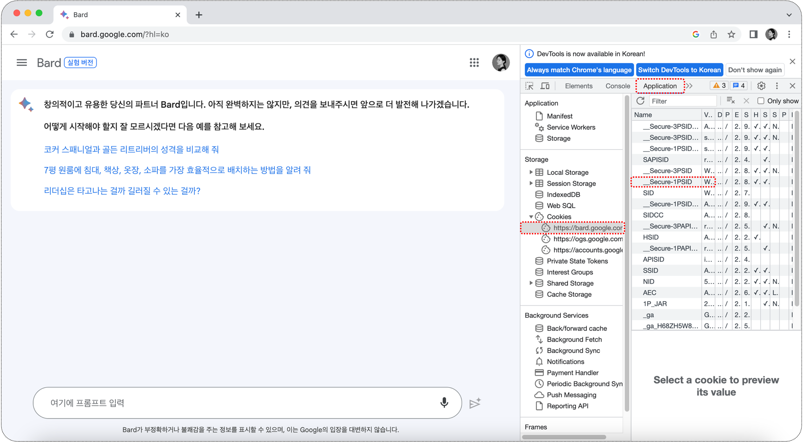

# Bard

## API key
- ```개발자도구``` - ```Application``` - ```Storage``` - ```Cookies``` - https://bard.google.com click
- ```Name``` feature  ```Value``` copy
  - __Secure-1PSID
  - __Secure-1PSIDCC
  - __Secure-1PSIDTS
- ```pip install bardapi```


